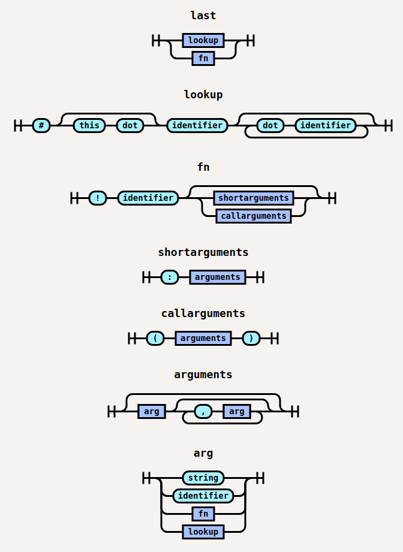

# LogDNA's Test Setup Chain
[](https://github.com/semantic-release/semantic-release)&nbsp;<!-- ALL-CONTRIBUTORS-BADGE:START - Do not remove or modify this section -->[](#contributors-)<!-- ALL-CONTRIBUTORS-BADGE:END -->

<!-- vim-markdown-toc GFM -->

* [Program Flow](#program-flow)
  * [State](#state)
  * [Auto-Exposing Action Handlers](#auto-exposing-action-handlers)
  * [Custom Action Signatures](#custom-action-signatures)
  * [Required Task Format](#required-task-format)
* [API](#api)
  * [constructor](#new-setupchainstate-actions)
  * [set(label, value)](#setlabel-value)
  * [map(collection, iterator, label)](#mapcollection-iterator-label)
  * [sort(collection, comparator, label)](#sortcollection-comparator-label)
  * [repeat(times, name, opts, label)](#repeattimes-name-opts-label)
  * [sleep(opts)](#sleepopts)
  * [reset()](#reset)
  * [execute()](#execute)
  * [lookup(input)](#lookupinput)
* [Usage](#usage)
  * [Creating a chain](#creating-a-chain)
  * [Actions](#actions)
    * [Adding a New Action](#adding-a-new-action)
  * [Helper Functions via Lookup](#helper-functions-via-lookup)
    * [random(bytes)](#randombytes)
    * [template(input)](#templateinput)
    * [Exposing a New Helper Function](#exposing-a-new-helper-function)
* [LAST](#last)
  * [Interfaces](#interfaces)
    * [`Node`](#node)
    * [`Point`](#point)
    * [`Position`](#position)

<!-- vim-markdown-toc -->

This is a base class for implementing seed and resource data for test suites.  Integration tests that rely on
other data to exist prior to testing new features can use this package to easily generate
such things.  For example, to test a new User property, one must first create an Organization, then
add a User to belong to that Organization.  Using this package simplifies the code needed to do those
kinds of repetitive tasks in the test suite.

```bash
$ npm install @logdna/setup-chain [--save-dev]
```

# Program Flow

The `SetupChain` can be given `action` functions which will ultimately be executed by `async/await`
in the order they are given.  Action functions are through builder functions (usually with the same name),
placing a task onto a queue in the order specified, but they are not run until [.execute()](#execute) is called.  This
requires a handler function added to the `SetupChain` for each action to expose it.  This can
be done automatically (see below), or defined in the sub-class by the developer.

### State
The result returned from each action on the chain is stored in the state object. The label
parameter of task signature will be used as the property for the return value in state.
If omitted, the action name will be used instead (and if there are duplicate actions, the last one wins).

```javascript
const state = await chain
  .foo('first') // Assumes `foo` and `bar` are an echo functions that returns the input
  .foo('winner')
  .foo('third', 'foo_two')
  .bar({baz: 'foobarbaz'}, 'bar_label')
  .bar('baz')
  .execute()

> {foo: 'winner', foo_two: 'third', bar_label: {baz: 'foobarbaz'}, bar: 'baz'}
```

### Auto-Exposing Action Handlers

The `SetupChain` can automatically create `SetupChain.prototype[action]` as a builder function
to create the task on the queue.  To take advantage of this, the developer's action function **must**
use a signature of `async function(opts)`, and pass all options in that single object parameter.
If using this style, all action function definitions can be passed to the `SetupChain`
upon instantiation, and it will create these builder functions automatically.

### Custom Action Signatures

Occasionally, a developer may want a different action signature to provide a better style.
For example, the built-in action for `repeat` uses `.repeat(times, action, action_options, label)`
for its signature.  To do this, the developer must expose the action handler themselves
within their sub-class, and as long as the task is created with the [expected format](#required-task-format), that's
all that will be needed.  Remember to always `return this` at the end of any custom
action handler to maintain chainability.

### Required Task Format

When tasks go onto the queue, they **must** have the format of `[key, label, ...rest]`.
So, if a custom action signature is being used for an action named `myAction`, then
the action handler can accept parameters in whatever format, as long as they get pushed
onto the task queue with the format that `execute` expects.

```javascript
myCustomAction(firstParam, secondParam, label) {
  this.tasks.push(['myCustomAction', label, firstParam, secondParam])
  return this
}

```

# API

## `new SetupChain(state, actions)`

Instantiates a new chain instance. If passed an object, it will be used as the initial
internal state.  This is stored in `chain.state`, and is an object that holds the results
of all the action calls.  As the second parameter, the object of action functions
can be passed.

**Parameters**

* **state** [Object][] (_optional_): If passed, initializes the new chain with this state
* **actions** [Object][] (_optional_): An object containing action names and their functions

```javascript
const SetupChain = require('@logdna/setup-chain')
const my_actions = require('./my-action-functions.js')

const first_chain = new SetupChain(null, my_actions)
const first_state = await first_chain
  .func1()
  .func2()
  .execute()

> {func1: '...', func2: '...'}

// Initialize with a pre-existing state object  
const second_chain = new SetupChain({
  b: {
    c: 2
  , d: {
      e: 3
    }
  }
})

const second_state = await second_chain.execute()

> {b: {c: 2, d: {e: 3}}}
```

## `set(label, value)`

Manually sets a value that will be saved in the final output and persisted across
executions. This is a chain action resolved by [execute](#execute).

**Parameters**

* **label** [String][]|[Object][]: The name of the key to set in the final output. If
  this value is an [Object][], then each of its values will be passed through `this.lookup`
  for rendering.
* **value** `Any`(_optional_): Value to be stored at `label` in `setupChain.state`. This
  can also be a string in `lookup` form, beginning with a `#` or `!`. These will be passed
  through `this.lookup` and stored at `label` in `setupChain.state`.

**Returns:** `this<SetupChain>`

```javascript
const chain = new SetupChain()

chain.set('foo', 1)
await chain.execute()

> {foo: 1}
```

```javascript
const chain = new SetupChain()

chain.set({
  foo: 1
, 'a.b': '#foo'
, bar: '!random'
, combine: '!template:"foo-{{#foo}}, ab-{{#a.b}}"'
})
await chain.execute()

> {foo: 1, bar: 'af4b31', a: {b: 1}, combine: 'foo-1, ab-1'}
```

## `map(collection, iterator, label)`

Takes a collection (array, or `#lookup` value), and applies an iterator function to each item.
The return value from the iterator will be the final result.  Results are returned in an array,
and placed into the chain state at `label`. This is a chain action resolved by [execute](#execute).

**Parameters**

* **collection** [Array][]|[String][]: An array/collection of data to apply the map function to.  A string can be
  given in order to use `lookup`, e.g. `'#myUsers'`
* **iterator** [Function][]: This is the iterator function that will receive each collection item.  It can
  be an `async` or regular function that accepts `item`.  *Currently this does not support callbacks*
* **label** [String][]: Optional label in which to store the result.

**Returns:** `this<SetupChain>`

```javascript
const chain = new SetupChain()
const state = await chain
  .set('my_array', [1, 2, 3])
  .map('#my_array', async function addOneSecond(num) {
    const result = await addOne(num)
    return result
  }, 'one_sec_Func')
  .execute()

> {one_sec_Func: [2, 3, 4]}
```

## `sort(collection, comparator, label)`

Takes a collection (array, or `#lookup`) and applies a [sort function](https://developer.mozilla.org/en-US/docs/Web/JavaScript/Reference/Global_Objects/Array/sort)
to each item.  Although this uses Javascript's `sort` function under the hood (which mutates),
calling `setupChain.sort` will NOT mutate the input.  This is done for consistency since
the `lookup` result will sometimes provide a new array, and sometimes not.
This is a chain action resolved by [execute](#execute).

**Parameters**

* **collection** [Array][]|[String][]: An array/collection of data to apply the sort function to.  A string can be
  given in order to use `lookup`, e.g. `'#myCollection'`
* **comparator** [Function][]: This is the the comparator function ultimately used by Javascript's
  `Array.prototype.sort` function.  The input array *will not be mutated*.
* **label** [String][]: Optional label in which to store the result.

**Returns:** `this<SetupChain>`

```javascript
function comparator(a, b) {
  if (a < b) return -1
  if (a > b) return 1
  return 0
}
const chain = new SetupChain()
const state = await chain
  .set('cols', ['biz', 'zarf', 'biz', 'clunk', 'goof', 'app'])
  .sort(cols, comparator, 'cols_sorted')
  .execute()

> {cols_sorted: ['app', 'biz', 'biz', 'clunk', 'goof', 'zarf']}
```

## `repeat(times, name, opts, label)`

Executes each task added sequentially and collects the results into a single object.
This is a chain action resolved by [execute](#execute).

**Parameters**

* **times** [Number][]: The number of times to repeat the given action name
* **name** [String][]: The name of the action to execute.  This **must** already exist
  on the chain as a valid action.
* **opts** [Object][]: Any options that the named action requires.  Currently, this
  only supports actions with an `(opts)` signature.  Custom signatures are not yet
  supported.
* **label** [String][]: Optional label in which to store the result.

**Returns:** `this<SetupChain>`

```javascript
const SetupChain = require('@logdna/setup-chain')

class MyChain extends SetupChain {
  constructor(state) {
    super(state, {
      hello: async () => {
        return 'hi'
      }
    })
  }
}

const chain = new MyChain()
chain
  .repeat(5, 'hello', {}, 'result')
  .execute()
  .then((result) => {
    console.log(result)
  })

> {result: ['hi', 'hi', 'hi', 'hi', 'hi']}
```

## `sleep(opts)`

When used in a chain, it will wait for a specified number of milliseconds before returning. Since this is a chain action, the sleep will appear to happen sequentially
within the action chain.

**Parameters**

* **opts** [Object][]: configuration options
  * **ms** [Number][]: The number of milliseconds to wait before continuing

**Returns**: `this<SetupChain>`

## `reset()`

Manually clears internal state and any pending tasks

**Returns**: `this<SetupChain>`

## `execute()`

Resolves the promises returned by chain actions, and returns the result
of each action in a single object. This should be the final
method in any chain, otherwise the actions will not be resolved into values.
After `execute` is called, the return value is also stored in `chain.state` for
access later, even if the return value is not immediately used.

**Returns**: [Object][]

## `lookup(input)`

This function is generally used by actions to resolve values
from the chain as it is executes, thus this function **is not chainable**. For a chainable
action that persists a value to the chain state, use [set()](#setstringobject-any) instead.

**Parameters**

* **input** [String][]|[Object][]|[Array][]: The string path or object to look up

  * If the input is a string, and starts with a `#` symbol it is considered to be a lookup path and will
  return the requested value from internal state if found.
    * Array lookups should use the index value in dot notation, e.g. `#biz.1`
  * If the input is a string, and starts with a `!` symbol it is considered a function call and will call
    any registered actions from the chain instance and store the result in internal state.
  * If the input is an object, each key in the object will be resolved following the above rules.
  * If the input is an array, each item in the array will be resolved following the above rules.

**Returns:** [String][]|[Object][]|[Array][]

```javascript
const chain = new SetupChain()
const state = chain
  .set('one', 1)
  .set('two', 2)
  .set('three.one', 1)
  .set('four', ['a', 'b', 'c', {d: 'bleck'}])
  .set('five', '#four.2') // Indirectly use `lookup` within a chain
  .execute()

chain.lookup('#one') // 1
chain.lookup('#three') // {one: 1}
chain.lookup('#three.one') // 1
chain.lookup('#four.2') // 'c'
chain.lookup('#four.3.d') // 'bleck'
chain.lookup('!template:"{{#one}}{{#two}}{{#three.one}}"{{#four.0}}"') // '121a'

state.five // 'c'
```

# Usage

In your test suites you can instantiate a chain instance to perform a series of async tasks
while storing the result in a single object. Actions can do anything from returning
random data, inserting records into a data store, to sending log entries to a remote parser. Existing code from your project can be trivially wired up as actions on the chain. For example, if you had a `organization-create.js` and a `user-create.js`, they could be called like so:

```javascript
const state = await new MyChain()
  .createOrganization()
  .set('user_id', '!random:5')
  .createUser({id: '#user_id'})
  .execute()

console.log(state)

> {createOrganization: 'My Test Org!', createUser: '04335c3fcb'}
```

## Creating a chain

The base class is intended to give a starting point for creating targeted setup chains
for tests in your specific projects. The only requirement is setting local `actions`
property in the constructor which is an `Object` holding name / asnyc function parings

The base class provides a set default actions which you can choose to include. Each
action will be exposed via a builder function that queues a task.

```javascript
const SetupChain = require('@logdna/setup-chain')

const actions = require('../actions')
class MyChain extends SetupChain {
  constructor(state) {
    super(state, actions)
  }
}
```

## Actions

An action is simply an async function that performs some action and optionally returns
some value. Every action function is called in the context of the `SetupChain` instance.

### Adding a New Action

```javascript
const actions = {
  name: async (opts) => {
    return opts.name || randomName()
  }

  greet: async (opts) => {
    const defaults = {
      greeting: 'hello'
    , names: []
    }

    const config = this.lookup({
      ...defaults
    , ...opts
    })

    return config.names.map((name) => {
      return `${config.greeting} ${name}`
    })
  }
}

class MyChain extends SetupChain {
  constructor(state) {
    super(state, actions)
  }
}
```

The result of previous function calls in the chain can be passed as arguments into another.
The values of previous results can be accessed using the `#` symbol followed by the name
of the key. Simple Object path notation is supported

```javascript
const state = await new MyChain()
  .name({name: 'greg'}, 'name_1')
  .name({name: 'fred'}, 'name_2')
  .greet({
    greeting: 'Goodbye'
  , names: ['#name_1', '#name_2']
  }, 'greeting_1')
  .execute()

console.log(state)

{
  name_1: 'greg'
  name_2: 'fred'
, greeting_1: ['Goodbye greg', 'Goodbye fred']
}

```

## Helper Functions via `lookup`

The `lookup` function has the ability to execute functions when simple object path lookups aren't sufficient.
The syntax for function execution is as follows. Simple arguments can be passed.
If arguments are passed, numeric and boolean values will be casted to the
appropriate type. Everything else will be handled as a string. String arguments
must be quoted with either single or double quotes if the string contains a comma.
Functions may also be used as arguments, but must use the more conventional call `()`
syntax to ensure arguments are passed appropriately.

```
!<name>:arg,arg,arg
!<name>:"one,two",three
!<name>("one,two", !random:1, !foo("bar", "baz"), #nested.key)
```

### Included Helper Functions

There is a few helper functions that we felt were valuable enough to include in
the base class.

### `random(bytes)`
Generates a random HEX string. It accepts an optional single argument that specifies
the number of random bytes to generate. This can be used when generating
unique ids or names to be used in database records, for example. Combined with
`!template`, this is a useful helper function.

**Parameters**

* **bytes** [Number][]: The number of bytes in the result

**Returns:** [String][]

```javascript
chain.lookup('!random:2') // 3830
chain.lookup('!random:10') // eddbdf576eac2ded313d
```

### `template(input)`
Returns a string with replacement patterns from the chain. Templates are rendered in the
same sequence as other operations on the chain. Only the data from actions prior to the
template function will be available for replacement. `template` supports a basic bracket
syntax for replacements where everything in between double curly bracews (`{{ }}`) is
evaluated. This means that both `#` and `!` syntax is supported for deep
[lookup](#lookupinput) calls.

**Parameters**

* **input** [String][]: The string template to parse

**Returns:** [String][]

```javascript
await chain.set('name', 'World').execute()
await chain.set('foo', {bar: "baz"}).execute()

chain.lookup('!template:"Hello {{#name}}"') // Hello World
chain.lookup('!template:"Hello {{#name}} - {{#foo.bar}}"') // Hello World - baz
chain.lookup('!template:"Hello, my name is {{#name}}"') // Hello, my name is World
```

### Exposing a New Helper Function

Any instance method that is prefixed with `$` is available as an executable function through [lookup](#lookupinput) by using a `!` in from of the lookup string. In
these cases, the string will be [the parameters needed for the function](#helper-functions-via-lookup).

```javascript
class MyChain extends SetupChain {
  constructor(state) {
    super(state)
  }

  $max(...args) {
    return Math.max(...this.lookup(args))
  }
}
new MyChain({three: 3, val: 100})
  .lookup('!max: 1,2,#three,#val') // 100
```

# LAST

**L**ookup **A**bstract **S**yntax **T**ree

`last` is a specification for representing the [lookup](#lookupstringobjectarray)
input format as an abstract syntax tree. It implements the [unist][] spec.
This is the parser/lexer used when inspecting inputs for the `lookup` command. This
section is for documentation purposes only, and most likely will not be needed
by users of this package.




### Interfaces

#### `Node`

Represents the base stucture of all AST nodes

```idl
interface Node {
  type: string
  position: Position?
}
```

#### `Point`

Represents one place in a source file.

* `column`: (1-indexed integer) represents a column in the source input
* `offset`: (0-indexed integer) represents a character in the source input
* `line`: (1-indexed integer) represents the line in the source input

```idl
interface Point {
  line: number >= 1
  column: number >= 1
  offset: number >= 0?
}
```

#### `Position`

Position represents the location of a node in a source file.

* `start`: Represents the place of the first character of the parsed source region
* `end`: Represents the place of the first character after the parsed source region

 ```idl
interface Position {
  start: Point
  end: Point
}
```

### Nodes

#### `Root`

The entry point of a last([unist][]) syntax tree. It has no parents

#### `Function`

Represents a function call where `children` represent the positional arguments

```idl
interface Function <: Node {
  value: string
  children: [Node]
}
```

```gfm
!foo:1
```

Yields:

```javascript
{
  type: 'root'
, children: [{
    type: 'function'
  , value: 'foo'
  , children: [
      {type: 'literal', value: 1}
    ]
  }]
}
```


```gfm
!foo(1, bar(2))
```

Yields:

```javascript
{
  type: 'root'
, children: [{
    type: 'function'
  , value: 'foo'
  , children: [
      {type: 'literal', value: 1}
    , {
        type: 'function'
      , value: 'bar'
      , children: [
          {type: 'literal', value: 2}
        ]
      }
    ]
  }]
}
```
#### `Lookup`

```idl
interface Function <: Node {
  value: string
}
```

```gfm
 #foo.bar
```

Yields:

```javascript
{
  type: 'root'
, children: [{
    type: 'lookup'
  , value: 'foo.bar'
  }]
}
```

[Object]: https://mdn.io/object
[String]: https://mdn.io/string
[Array]: https://mdn.io/array
[Number]: https://mdn.io/number
[Function]: https://mdn.io/function
[unist]: https://github.com/syntax-tree/unist

## Contributors ✨

Thanks goes to these wonderful people ([emoji key](https://allcontributors.org/docs/en/emoji-key)):

<!-- ALL-CONTRIBUTORS-LIST:START - Do not remove or modify this section -->
<!-- prettier-ignore-start -->
<!-- markdownlint-disable -->
<table>
  <tr>
    <td align="center"><a href="https://github.com/darinspivey"><br /><sub><b>Darin Spivey</b></sub></a><br /><a href="https://github.com/logdna/setup-chain-node/commits?author=darinspivey" title="Code">💻</a> <a href="https://github.com/logdna/setup-chain-node/commits?author=darinspivey" title="Documentation">📖</a> <a href="#maintenance-darinspivey" title="Maintenance">🚧</a> <a href="https://github.com/logdna/setup-chain-node/commits?author=darinspivey" title="Tests">⚠️</a> <a href="https://github.com/logdna/setup-chain-node/pulls?q=is%3Apr+reviewed-by%3Adarinspivey" title="Reviewed Pull Requests">👀</a></td>
    <td align="center"><a href="http://codedependant.net/"><br /><sub><b>Eric Satterwhite</b></sub></a><br /><a href="https://github.com/logdna/setup-chain-node/commits?author=esatterwhite" title="Code">💻</a> <a href="https://github.com/logdna/setup-chain-node/commits?author=esatterwhite" title="Documentation">📖</a> <a href="#maintenance-esatterwhite" title="Maintenance">🚧</a> <a href="https://github.com/logdna/setup-chain-node/commits?author=esatterwhite" title="Tests">⚠️</a> <a href="https://github.com/logdna/setup-chain-node/pulls?q=is%3Apr+reviewed-by%3Aesatterwhite" title="Reviewed Pull Requests">👀</a></td>
    <td align="center"><a href="https://github.com/mdeltito"><br /><sub><b>Mike Del Tito</b></sub></a><br /><a href="https://github.com/logdna/setup-chain-node/commits?author=mdeltito" title="Code">💻</a> <a href="https://github.com/logdna/setup-chain-node/commits?author=mdeltito" title="Documentation">📖</a> <a href="#maintenance-mdeltito" title="Maintenance">🚧</a> <a href="https://github.com/logdna/setup-chain-node/commits?author=mdeltito" title="Tests">⚠️</a> <a href="https://github.com/logdna/setup-chain-node/pulls?q=is%3Apr+reviewed-by%3Amdeltito" title="Reviewed Pull Requests">👀</a></td>
    <td align="center"><a href="https://evanlucas.com/"><br /><sub><b>Evan Lucas</b></sub></a><br /><a href="https://github.com/logdna/setup-chain-node/commits?author=evanlucas" title="Code">💻</a> <a href="https://github.com/logdna/setup-chain-node/commits?author=evanlucas" title="Documentation">📖</a> <a href="#maintenance-evanlucas" title="Maintenance">🚧</a> <a href="https://github.com/logdna/setup-chain-node/commits?author=evanlucas" title="Tests">⚠️</a> <a href="https://github.com/logdna/setup-chain-node/pulls?q=is%3Apr+reviewed-by%3Aevanlucas" title="Reviewed Pull Requests">👀</a></td>
  </tr>
</table>

<!-- markdownlint-restore -->
<!-- prettier-ignore-end -->

<!-- ALL-CONTRIBUTORS-LIST:END -->

This project follows the [all-contributors](https://github.com/all-contributors/all-contributors) specification. Contributions of any kind welcome!